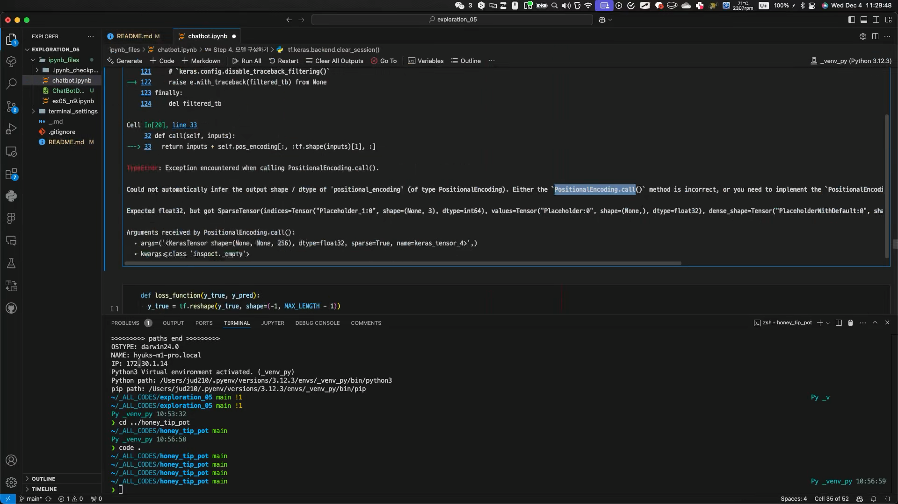
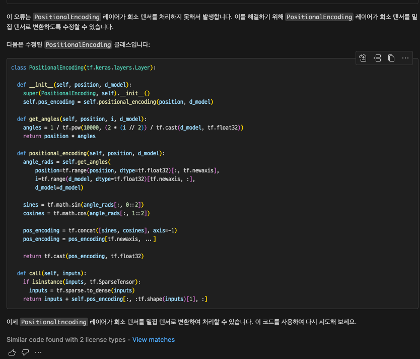
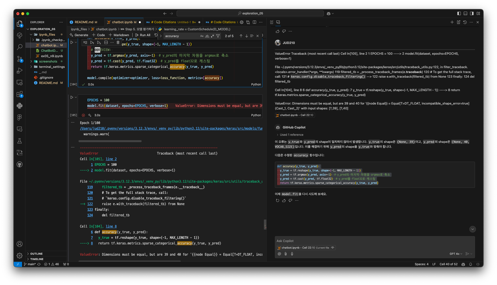
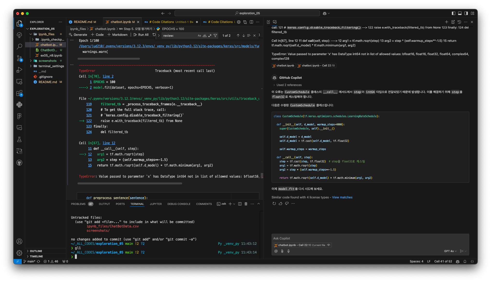

# Exploration 05 Project - 권오근, 이동수, 민혁

## 팁 공유

- 참고하면 좋은 사이트 (LMS 작성자의 원본 ebook)
  - <https://wikidocs.net/31379>

- 플러터 채팅 앱 원본
  - <https://github.com/Xim-ya/basic_chat_ui_Implementation>

- 소미 이미지 생성 프롬프트

```plaintext
prompt
1girl, long black hair, blue eyes, wearing plain white shirt, denim shorts, cute, beautiful, city, absurdres, high res, ultrasharp, 8K, masterpiece, looking at viewer

negative label
verybadimagenegative_v1.3, ng_deepnegative_v1_75t, (ugly face:0.8),cross-eyed,sketches, (worst quality:2), (low quality:2), (normal quality:2), lowres, normal quality, ((monochrome)), ((grayscale)), skin spots, acnes, skin blemishes, bad an

bad anatomy, DeepNegative, facing away, tilted head, {Multiple people}, lowres, bad anatomy, bad hands, text, error, missing fingers, extra digit, fewer digits, cropped, worstquality, low quality, normal quality, jpegartifacts, signature, watermark, usern
```

## 문제 및 해결

종결 코드: chatbotshit.ipynb (by 오근킹)

### 문제 0



원인

- PositionalEncoding 레이어에서 SparseTensor를 연산하려고 할 때 발생하는 문제입니다.

해결

- 데이터셋 변환 시 Dense 보장 (모델에 들어가는 입력이 SparseTensor로 변환되지 않도록 보장하는 것)
- Input Layer에서 명시적으로 sparse=False 지정
- PositionalEncoding 내부에서 처리 (비추천) <- 이건 적용안함

### 문제 1



원인

- tf.sparse.is_sparse() 라는 함수나 속성이 TensorFlow 2.x에서 더 이상 제공되지 않는 것에서 비롯됩니다.
- 과거 TensorFlow 1.x에서는 tf.sparse.is_sparse()가 존재했지만, 2.x에서는 이를 사용할 수 없습니다.
- 대신, TensorFlow에서는 tf.sparse 모듈 내 연산을 사용하려면 주어진 텐서가 tf.SparseTensor 타입인지 직접 확인하는 방식을 사용합니다.

해결

- tf.sparse.is_sparse()는 사용 불가능합니다.
- 대신 isinstance(tensor, tf.SparseTensor)를 사용하여 SparseTensor 여부를 확인합니다.
- 이를 통해 SparseTensor일 경우 tf.sparse.to_dense()로 변환하는 로직을 적용했습니다.

### 문제 2



원인

- 해당 오류는 실제 y_true(타겟)와 y_pred(모델 출력)의 시퀀스 길이 차이에서 비롯됩니다. 에러 메시지를 자세히 보면 다음과 같습니다.
- 39 , 40 문제.

해결

- loss_function에서 불필요한 reshape 제거
- dec_inputs와 outputs의 길이가 39로 동일하게 유지되는지 확인
- 필요하다면 loss_function 내에서 y_pred를 y_true 길이에 맞게 슬라이싱 (임시 방편)

### 문제 3



원인

- 현재 CustomSchedule 클래스의 __call__ 메서드에서 step은 int64 형태로 들어옵니다.
- tf.math.rsqrt 및 tf.math.minimum 등 부동소수점 연산은 float형 입력을 기대합니다.
- 따라서 step을 float32로 캐스팅해줘야 합니다.

해결

- CustomSchedule 클래스의 __call__ 메서드에서 step을 tf.cast(step, tf.float32)로 변환함으로써 int64에서 float32 타입으로 맞춰주었습니다.
- 이로써 tf.math.rsqrt 함수 호출 시 데이터 타입 문제를 해결할 수 있습니다.

## 코더 회고

- 배운 점
  - 권오근: 트랜스포머의 구조를 직접 구현해보고 작동까지 시켜봐서 의미가 있었습니다.
  - 이동수: 어려웠던 부분들도 많았지만 기초적인 개념들을 배울 수 있었고 재밌게 할 수 있었습니다.
  - 민혁
    - 전체적인 개념 자체는 제대로 이해되지 않았지만, 코드 예제가 제공된 덕분에 어떻게 트랜스포머 모델을 학습하고 돌려볼 수 있는지 배울 수 있어 좋았습니다.
    - 플러터 앱을 제작할 때, 다른 사람의 오픈소스를 활용/참조하여 o1-preview에 적절한 프롬프트를 사용하면 완전히 새로운 앱을 금방 만들 수 있음을 배웠습니다.
    - GPT API 키를 활용하여 채팅 앱을 제작하는 게 생각보다 매우매우 쉽다는 것을 발견했습니다.

- 아쉬운 점
  - 권오근: 전반적인 흐름에 대해서 깊은 이해가 부족했던 것 같습니다.
  - 이동수: 전체적인 과정에 대한 이해나 플러터에 부족함이 느껴 아쉬웠습니다.
  - 민혁: 컨테이너 환경과 맥 환경에서의 버전 이슈 때문에 model.fit 또는 model.save 가 원활하게 진행되지 못하였던 점이 너무 아쉬웠습니다.

- 느낀 점
  - 권오근: 역시 코딩은 재미있는 것을 만들 때 가장 재미있다.
  - 이동수: 트랜스포머에 대한 코드 형성에 대한 이해가 더 필요할 것 같습니다.
  - 민혁: 역시 코딩은 진짜 만들고 싶었던 무언가를 만들 때에 제일 재밌는 것 같습니다. 그렇다고 미연시를 만들고 싶었던 건 아니고요.

- 어려웠던 점
  - 권오근: LMS에 제공하는 코드가 로컬 및 코랩에서 호환이 안되었는데 해결하는데에 오랜시간이 걸렸습니다.
  - 이동수: 트랜스포머가 많이 어렵다고 느껴졌습니다.
  - 민혁: o1-preview 없이는 살 수 없는 몸이 되었습니다.

## 피어리뷰 템플릿

- 리뷰어:

- [x]  __1. 주어진 문제를 해결하는 완성된 코드가 제출되었나요? (완성도)__
  - 문제에서 요구하는 최종 결과물이 첨부되었는지 확인
  - 문제를 해결하는 완성된 코드란 프로젝트 루브릭 3개 중 2개,
    퀘스트 문제 요구조건 등을 지칭
    - 해당 조건을 만족하는 부분의 코드 및 결과물을 캡쳐하여 사진으로 첨부  
      


- [x]  __2. 프로젝트에서 핵심적인 부분에 대한 설명이 주석(닥스트링) 및 마크다운 형태로 잘 기록되어있나요? (설명)__
  - [x]  모델 선정 이유
  - [x]  하이퍼 파라미터 선정 이유
  - [x]  데이터 전처리 이유 또는 방법 설명  
    


- [x]  __3. 체크리스트에 해당하는 항목들을 수행하였나요? (문제 해결)__
  - [x]  데이터를 분할하여 프로젝트를 진행했나요? (train, validation, test 데이터로 구분)
  - [x]  하이퍼파라미터를 변경해가며 여러 시도를 했나요? (learning rate, dropout rate, unit, batch size, epoch 등)
  - [x]  각 실험을 시각화하여 비교하였나요?
  - [x]  모든 실험 결과가 기록되었나요?  
    


- [x]  __4. 프로젝트에 대한 회고가 상세히 기록 되어 있나요? (회고, 정리)__
  - [x]  배운 점
  - [x]  아쉬운 점
  - [x]  느낀 점
  - [x]  어려웠던 점

- [x]  __5.  앱으로 구현하였나요?__
  - [x]  구현된 앱이 잘 동작한다.
  - [x]  모델이 잘 동작한다.

## 리뷰어 회고(참고 링크 및 코드 개선)

```Plaintext
<리뷰어 회고>
고은비: 소미와의 챗... 세팅해놓은 사항이 잘 학습하여져 답변을 구경하는 재미?가 있었습니다 (만드신 분들이 넘 즐거워하시더라구요 ㅎㅎㅎ) ^^ 수고하셨습니다!
김승기: 학습한 모델을 앱에 적용시키진 못했지만 gpt3.5를 연결하여 꽤나 완성도가 높은 어플을 볼 수 있었습니다.
강윤제: gpt를 열결하여 ai를 불러와서 작동이 잘되었고 ai의 성격이나 특징을 설정해 놓아서 사람과 대화하듯이 진행되는게 놀라웠습니다. 다만 중간중간 앱을 다시 불러왔을 때 api가 끈기는 형상 이라던가 보안해야 되는 부분이 눈에 보였다. 오늘 만드시느라 고생하셨고 인상 깊었습니다!^^
```
